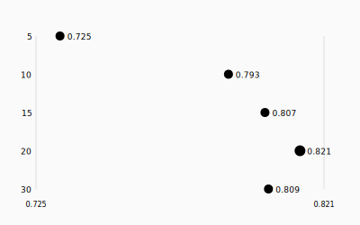
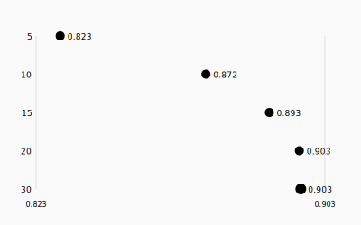
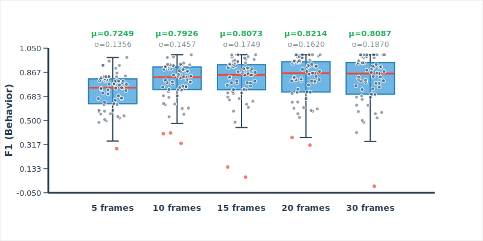
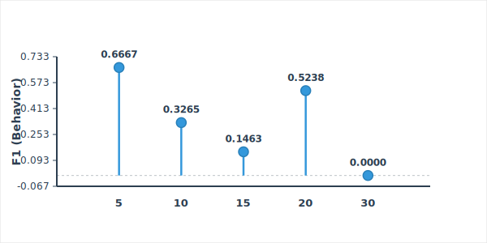

# Window Size Analysis Application

> **Analyze cross-validation results to determine optimal window sizes for behavior classification**



## Purpose

This application analyzes cross-validation results from behavior classification experiments to determine the optimal window size for feature generation and classification. The analysis compares performance metrics (accuracy, precision, recall, F1 scores) across different window sizes (5, 10, 15, 20, 25, 30 frames) to identify:

1. **Best window size** for optimal classification performance
2. **Worst performing videos** that may need data quality review
3. **Most window-sensitive videos** that show high variability across window sizes
4. **Performance patterns** and trends across different temporal scales

The application is designed to handle variable numbers of videos, window sizes, and features, making it generalizable to different experimental setups.

## Key Features

- **Robust Data Parsing**: Extracts structured data from semi-structured text files
- **Comprehensive Validation**: Ensures data integrity and consistency
- **Statistical Analysis**: Identifies best window sizes and performance patterns
- **Interactive HTML Reports**: Beautiful, comprehensive reports with visualizations
- **Animal-Level Analysis**: Correctly handles cross-validation where one animal (identity) is held out at a time

## Quick Preview

<div align="center">

### Performance Metrics Comparison

| F1 (Behavior) | Mean Accuracy |
|:---:|:---:|
|  |  |

### Distribution Analysis



### Window Sensitivity Analysis



</div>

## Directory Structure

```
window_size_analysis/
├── data/
│   ├── raw/
│   │   └── Window size scan.txt          # Input file (place your scan results here)
│   └── processed/
│       ├── video_results.csv             # Parsed video-level performance data
│       ├── summary_stats.csv             # Window-level summary statistics
│       ├── feature_importance.csv        # Feature importance rankings per window
│       ├── validation_report.txt         # Data validation results
│       └── window_size_analysis_report.tex  # LaTeX report source
├── reports/
│   └── window_size_analysis_report.html  # Main HTML analysis report
├── scripts/
│   ├── parse_window_results.py          # Parses text file to CSV
│   ├── validate_conversion.py          # Validates parsed data
│   ├── generate_html_report.py         # Generates HTML report
│   └── generate_latex_report.py        # Generates LaTeX report
├── reports/
│   └── window_size_analysis.html         # Copy of main report
└── README.md
```

## Testing

The application includes comprehensive unit and end-to-end tests. To run tests:

```bash
# Install test dependencies
pip install -r requirements-test.txt

# Run all tests
./run_tests.sh

# Or run with pytest directly (uses pytest.ini from tests/)
pytest tests/ -v

# Run only unit tests
pytest tests/unit -v

# Run only end-to-end tests
pytest tests/e2e -v
```

Tests are automatically run on:
- **Pre-commit**: When you commit changes (if pre-commit is installed)
- **CI/CD**: On GitHub Actions when pushing to main/master/develop branches

To set up pre-commit hooks:
```bash
pip install pre-commit
pre-commit install
```

## Quick Start

```bash
# 1. Place your input file
cp /path/to/Window\ size\ scan.txt data/raw/

# 2. Run the complete pipeline
cd window_size_analysis
python3 scripts/parse_window_results.py
python3 scripts/validate_conversion.py
python3 scripts/generate_html_report.py
python3 scripts/generate_latex_report.py

# 3. View the reports
open reports/window_size_analysis_report.html  # HTML with visualizations
# To compile LaTeX to PDF (PDF will be created in reports folder):
cd reports && pdflatex window_size_analysis_report.tex && pdflatex window_size_analysis_report.tex
# Then view the PDF:
open reports/window_size_analysis_report.pdf
```

That's it! You now have both HTML (with visualizations) and LaTeX (with detailed narrative) reports.

## Requirements

- **Python 3.6+** (uses only standard library - no external dependencies required)
- Input file: `Window size scan.txt` in `data/raw/` directory

## Usage

### Step 1: Place Input File

Place your window size scan results file in `data/raw/` as `Window size scan.txt`

The file should contain cross-validation results with format:
```
Window 10

========================================================================================================================
SUMMARY

      accuracy         precision     precision            recall        recall      f beta score    f beta score  test - leave one out:
                  (not behavior)    (behavior)    (not behavior)    (behavior)    (not behavior)      (behavior)  (video [identity])
--  ----------  ----------------  ------------  ----------------  ------------  ----------------  --------------  -----------------------------------------------------------------
 0    0.978528          1             0.740741          0.977124      1                 0.98843         0.851064  org-3-uploads-stage.study_410.cage_4482.2025-07-14.13.38.mp4 [0]
...
```

### Step 2: Parse Data

```bash
cd window_size_analysis
python3 scripts/parse_window_results.py
```

This generates:
- `data/processed/video_results.csv` - Individual video performance metrics
- `data/processed/summary_stats.csv` - Summary statistics per window size
- `data/processed/feature_importance.csv` - Top features per window

### Step 3: Validate Data

```bash
python3 scripts/validate_conversion.py
```

This creates `data/processed/validation_report.txt` with validation results including:
- Row count consistency
- Video-identity pair consistency across windows
- Data integrity checks
- Summary statistics validation

### Step 4: Generate Reports

**HTML Report:**
```bash
python3 scripts/generate_html_report.py
```

This generates `reports/window_size_analysis_report.html` - a comprehensive HTML report with all analyses and visualizations.

**LaTeX Report (with more narrative):**
```bash
python3 scripts/generate_latex_report.py
```

This generates `reports/window_size_analysis_report.tex` - a LaTeX document with detailed narrative analysis and embedded plots. To compile to PDF:

```bash
cd reports
pdflatex window_size_analysis_report.tex
pdflatex window_size_analysis_report.tex  # Run twice for proper table of contents
```

The LaTeX report includes more detailed narrative explanations, statistical interpretations, and academic-style discussion sections.

## Output Files

### Processed Data Files

1. **`video_results.csv`**
   - Contains performance metrics for each (video, identity, window) combination
   - Columns: `window_size`, `video_id`, `video_name`, `identity`, `accuracy`, `precision_not_behavior`, `precision_behavior`, `recall_not_behavior`, `recall_behavior`, `f1_not_behavior`, `f1_behavior`
   - Used for detailed per-video analysis

2. **`summary_stats.csv`**
   - Contains aggregated statistics for each window size
   - Columns: `window_size`, `mean_accuracy`, `sd_accuracy`, `mean_f1_behavior`, `sd_f1_behavior`, `mean_f1_not_behavior`, `sd_f1_not_behavior`
   - Used for window size comparison

3. **`feature_importance.csv`**
   - Contains top features by importance for each window size
   - Columns: `window_size`, `rank`, `feature_name`, `importance`
   - Used for understanding which features drive performance

4. **`validation_report.txt`**
   - Text file with validation results
   - Reports data consistency, completeness, and integrity

### Main Reports

**`window_size_analysis_report.html`** - Comprehensive HTML report containing:

#### Section 1: Window Size Comparison
- Performance comparison table with all metrics
- Best values highlighted in each column
- F1 (Behavior) emphasized as most relevant metric
- Barbell/dot plots for each metric showing performance across window sizes

#### Section 2: Per-Video Performance Distribution
- Box-whisker plots showing distribution of accuracy and F1 (Behavior) across all videos
- Individual points represent each video/iteration
- Summary statistics (mean, SD) displayed above each box
- Outliers highlighted in red

#### Section 3: Worst Performing Videos
- Detailed table showing worst videos with performance at each window size
- Red highlighting for worst-performing window per video
- Secondary table showing worst video at each window size
- Helps identify which videos struggle at specific window sizes

#### Section 4: Most Window-Sensitive Videos
- Table of videos with highest coefficient of variation (calculated using F1 Behavior)
- Lollipop plots in grid layout showing F1 (Behavior) across window sizes
- All plots use same y-axis scale for easy comparison
- Each plot shows how a video's performance varies with window size

#### Section 5: Key Findings
- Best window size recommendation with justification
- Performance trends analysis
- Detailed explanation of why the recommended window size is optimal
- Emphasis on F1 (Behavior) as the most relevant metric

#### Section 6: Video Performance Analysis
- Analysis of worst performing videos
- Analysis of window-sensitive videos
- Recommendations for investigation

#### Section 7: Data Quality Notes
- Explanation of cross-validation structure (one animal held out at a time)
- Notes on data completeness

#### Section 8: Recommendations
- Primary recommendation for window size
- Alternative considerations
- Investigation priorities

**`window_size_analysis_report.tex`** - LaTeX report with detailed narrative analysis containing:

#### Sections with Enhanced Narrative:
- **Introduction**: Purpose, scope, data structure explanation, and performance metrics overview
- **Executive Summary**: Key findings with detailed interpretation
- **Window Size Comparison**: Performance metrics table with detailed interpretation and statistical context
- **Per-Video Performance Distribution**: Distribution analysis with narrative about variability patterns
- **Worst Performing Videos**: Identification methodology, implications, and recommendations
- **Window Sensitivity Analysis**: Coefficient of variation explanation, interpretation of sensitivity patterns
- **Statistical Analysis and Findings**: Detailed analysis of performance trends by window size category
- **Discussion**: Implications for behavior classification, limitations, and future directions
- **Recommendations**: Comprehensive recommendations with justifications
- **Conclusion**: Summary of key findings and future work
- **Appendices**: Complete summary statistics and data file descriptions

The LaTeX report provides more academic-style narrative, detailed statistical interpretations, and comprehensive discussion of findings compared to the HTML report.

## Key Questions Answered

### 1. Which Window Size is Best?

The report identifies the optimal window size based on:
- **Mean accuracy** across all videos
- **F1 (Behavior)** - the most relevant metric for behavior classification
- **Stability** (standard deviation)
- **Balance** between performance and computational efficiency

**Example Output**: Window 20 frames shows best overall performance with mean accuracy of 0.90262 and F1 (Behavior) of 0.82141.

### 2. Which Videos Perform Worst?

The report identifies:
- Videos with lowest mean accuracy across all window sizes
- Performance breakdown by window size for each worst video
- Which specific window size causes worst performance for each video

**Example Output**: Top 10 worst performing videos with detailed performance metrics at each window size.

### 3. Which Videos are Most Sensitive to Window Size?

The report identifies:
- Videos with highest coefficient of variation (CV) in F1 (Behavior)
- Visual lollipop plots showing performance variation across window sizes
- Videos that may benefit from window size optimization

**Example Output**: Top 10 most sensitive videos with CV values and visual plots.

### 4. Other Interesting Findings

- Performance trends across window sizes
- Correlation between window size and performance
- Stability analysis
- Feature importance patterns

## Visualizations

The HTML report includes several types of visualizations. Here are some examples:

### 1. Barbell/Dot Plots (Section 1)
**Purpose**: Compare performance metrics across window sizes

**Features**:
- Horizontal lines (barbells) from minimum to each value
- Dots at each window size value
- Best value highlighted in red
- Compact design, all 6 plots displayed in one row
- Window sizes ordered: 5, 10, 15, 20, 25, 30 frames

**Metrics Shown**:
- Mean Accuracy
- SD Accuracy (lower is better)
- Mean F1 (Behavior) ⭐ - Most Relevant (highlighted in red section)
- SD F1 (Behavior) (lower is better)
- Mean F1 (Not Behavior)
- SD F1 (Not Behavior) (lower is better)

**Example**: Shows that Window 20 frames has the highest F1 (Behavior) value, highlighted in red.

#### F1 (Behavior) - Most Important Metric


#### Mean Accuracy


### 2. Box-Whisker Plots (Section 2)
**Purpose**: Show distribution of performance across all videos for each window size

**Features**:
- Box shows quartiles (Q1, median, Q3)
- Whiskers extend to 1.5×IQR
- Individual points represent each video/iteration
- Outliers highlighted in red
- Summary statistics (μ=mean, σ=SD) displayed above each box
- Large, readable text and clear axis labels

**Metrics Shown**:
- Accuracy Distribution by Window Size
- F1 (Behavior) Distribution by Window Size ⭐

**Example**: Shows that Window 20 frames has a higher median and tighter distribution than smaller windows, with fewer outliers.


### 3. Lollipop Plots (Section 4)
**Purpose**: Visualize how F1 (Behavior) varies across window sizes for sensitive videos

**Features**:
- Grid layout (2 columns, responsive to 1 column on small screens)
- All plots use the same y-axis scale for easy comparison
- Horizontal baseline with vertical lines (sticks) to each value
- Circles (lollipops) at each F1 (Behavior) value
- Value labels above each point
- Window size labels below

**Shown For**: Top 10 most window-sensitive videos

**Example**: Shows videos where F1 (Behavior) varies dramatically across window sizes, helping identify which videos need window size optimization.


### 4. Performance Tables
**Purpose**: Quick comparison of metrics across window sizes

**Features**:
- Best value in each column highlighted in green
- F1 (Behavior) best value highlighted in red (most relevant metric)
- Comprehensive metrics for each window size
- Clear visual hierarchy

**Example**: Window 20 frames highlighted as best for F1 (Behavior) in red, with other best values in green.

## Data Structure Understanding

### Cross-Validation Structure

The application correctly handles the cross-validation structure where:
- **Each video contains multiple animals** (identities)
- **Cross-validation holds out one animal at a time** (not one video at a time)
- **Each animal is identified** by identity number [0], [1], [2], etc. at the end of the video filename
- **Each (video_name, identity) pair** represents a separate test case

Example:
```
org-3-uploads-stage.study_410.cage_4482.2025-07-14.13.38.mp4 [0]  # Animal 0
org-3-uploads-stage.study_410.cage_4482.2025-07-14.13.38.mp4 [1]  # Animal 1
org-3-uploads-stage.study_410.cage_4482.2025-07-14.13.38.mp4 [2]  # Animal 2
```

The same video file appears multiple times because each animal is held out separately during cross-validation.

## Generalizability

The application is designed to handle:
- **Variable number of videos** (automatically detected)
- **Variable number of window sizes** (all parsed dynamically)
- **Variable number of features** (top features per window)
- **Different text formats** (robust parsing with error handling)

## Example Workflow

```bash
# 1. Place your scan results file
cp /path/to/your/scan.txt data/raw/Window\ size\ scan.txt

# 2. Parse the data
python3 scripts/parse_window_results.py

# 3. Validate the conversion
python3 scripts/validate_conversion.py

# 4. Generate the report
python3 scripts/generate_html_report.py

# 5. Open the report
open reports/window_size_analysis_report.html
# Or on Linux:
# xdg-open reports/window_size_analysis_report.html
```

## Example Outputs

### Report Sections Overview

The generated HTML report (`window_size_analysis_report.html`) contains:

1. **Executive Summary** - Key findings at a glance with best window size recommendation
2. **Window Size Comparison** - Table with highlighted best values + 6 barbell plots
3. **Per-Video Performance Distribution** - 2 large box-whisker plots (Accuracy & F1 Behavior)
4. **Worst Performing Videos** - Detailed table with per-window performance + worst-by-window table
5. **Most Window-Sensitive Videos** - Table + 10 lollipop plots in grid layout
6. **Key Findings** - Detailed analysis and recommendations
7. **Video Performance Analysis** - Worst and sensitive video analysis
8. **Data Quality Notes** - Cross-validation structure explanation
9. **Recommendations** - Actionable recommendations

### Sample Findings

Based on the current dataset:

- **Best Window Size**: 20 frames
  - Mean Accuracy: 0.90262
  - Mean F1 (Behavior): 0.82141
  - Good stability (SD = 0.089034)

- **Performance Trend**: Larger windows (20-30 frames) significantly outperform smaller windows (5-10 frames)

- **Total Videos Analyzed**: 52 unique videos across 5 window sizes
- **Total Test Cases**: 305 (video, identity, window) combinations

### Visualization Examples

**Barbell Plots**: Show clear performance differences between window sizes, with Window 20 consistently near the top for most metrics.

**Box-Whisker Plots**: Reveal that Window 20 has:
- Higher median accuracy than smaller windows
- Tighter distribution (fewer outliers) than Window 30
- Good balance between performance and stability

**Lollipop Plots**: Show which videos have highly variable F1 (Behavior) across window sizes, helping identify videos that may benefit from window size optimization.

## Technical Details

### Parsing Logic

The parser:
- Identifies window size sections (e.g., "Window 10", "Window 15 frames")
- Extracts video performance metrics from fixed-width format
- Parses identity numbers from brackets [0], [1], [2]
- Handles variable spacing and formatting
- Extracts summary statistics and feature importance

### Validation Checks

The validator checks:
- Row count consistency across windows
- Video-identity pair consistency
- Numeric value ranges
- Missing data
- Summary statistics accuracy

### Report Generation

The report generator:
- Calculates statistics from parsed data
- Creates SVG visualizations (no external dependencies)
- Generates comprehensive HTML with embedded CSS
- Highlights best values and important findings
- Emphasizes F1 (Behavior) as most relevant metric

## Troubleshooting

### Parser finds 0 videos
- Check that the input file format matches the expected structure
- Ensure window size headers are present (e.g., "Window 10", "Window 15 frames")
- Check that video rows contain numeric metrics before the video name

### Validation reports inconsistencies
- Some videos may legitimately be missing from certain windows (data collection issues)
- Multiple entries for same video with different identities is expected
- Review `validation_report.txt` for details

### Report generation errors
- Ensure all CSV files are present in `data/processed/`
- Check that numeric columns contain valid values
- Review error messages for specific issues

## License

See LICENSE file in parent directory.

## Contact

For questions or issues, refer to the validation report or check the parsed data files for data quality issues.
